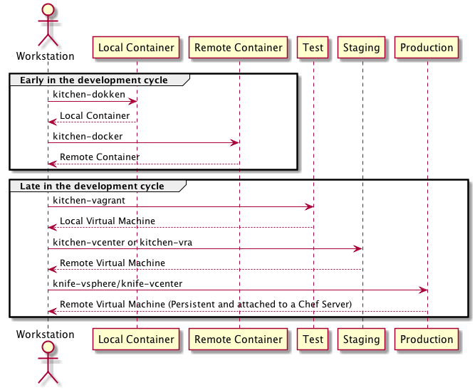

# vmware-pipeline-example

A simple cookbook to drop in a VMware's infrastructure to demo a Cookbook development pipeline, I have an explanation of
this cookbook [here](http://jjasghar.github.io/blog/2018/07/24/cookbook-development-with-a-pure-vmware-stack/).

## SCOPE

An example cookbook to get a full VMware ecosystem "pipeline" put together.

## Suggested Pre-requirements

### PhotonOS

- Install Photon OS 2.0 the instructions are [here](https://github.com/vmware/photon/wiki/Running-Photon-OS-on-vSphere).
- Enable remote Docker connections on above Photon instance, instructions are [here](https://jjasghar.github.io/blog/2017/03/29/photonos-as-your-backend-for-kitchen-docker/).
- NOTE: You probably want to turn this into a template after setting the password and turning on remote docker access.

### Docker (dokken)

- Install Docker on your local machine

### Vagrant

- Install Vagrant on your local machine

### vCenter

- Have access to a vCenter instance where a user has at least these permissions:

* Datastore
    * Allocate space :ballot_box_with_check:
    * Browse datastore :ballot_box_with_check:
* Host
    * Local Operations
         * Create virtual machine :ballot_box_with_check:
         * Delete virtual machine :ballot_box_with_check:
         * Manage user groups :ballot_box_with_check:
         * Reconfigure virtual machine :ballot_box_with_check:
 * Network
    * Assign Network :ballot_box_with_check:
 * Resource
    * Assign virtual machine to resource pool :ballot_box_with_check:
 * Virtual Machine :ballot_box_with_check:

## Usage

To demo a pipeline using the VMware's ecosystem.




## Testing

For more details look at the [TESTING.md](./TESTING.md).

## License & Authors

If you would like to see the detailed LICENCE click [here](./LICENCE).

- Author:: JJ Asghar <jj@chef.io>

```text
Copyright:: JJ Asghar

Licensed under the Apache License, Version 2.0 (the "License");
you may not use this file except in compliance with the License.
You may obtain a copy of the License at

http://www.apache.org/licenses/LICENSE-2.0

Unless required by applicable law or agreed to in writing, software
distributed under the License is distributed on an "AS IS" BASIS,
WITHOUT WARRANTIES OR CONDITIONS OF ANY KIND, either express or implied.
See the License for the specific language governing permissions and
limitations under the License.
```
